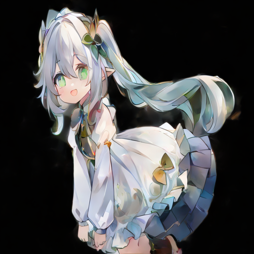
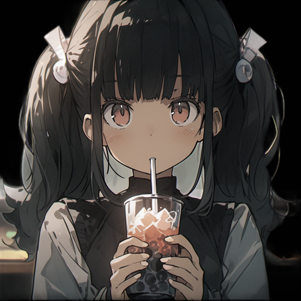
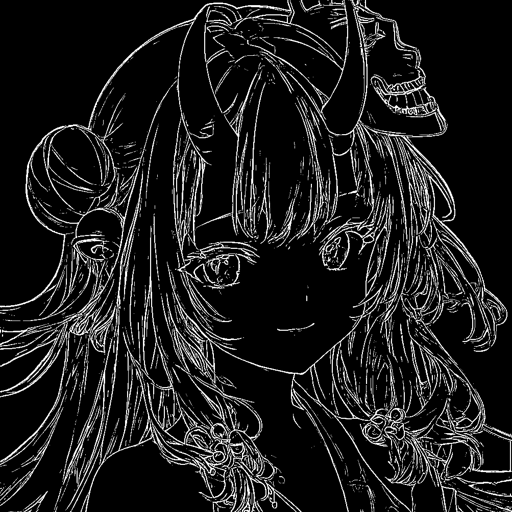
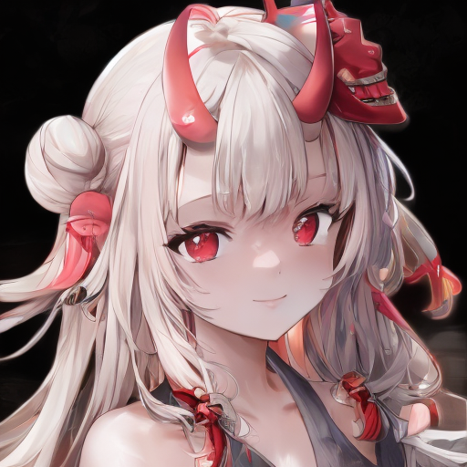

# Stable Diffusion Reference Only

A general model for secondary painting.[](https://arxiv.org/abs/2311.02343)


## Online Demo

Integrated into [Huggingface Spaces 🤗](https://huggingface.co/spaces) using [Gradio](https://github.com/gradio-app/gradio). Try it out  [](https://huggingface.co/spaces/AisingioroHao0/anime-fanwork)

Try it On [](https://colab.research.google.com/drive/1aLKbm8YAXsGP2Y3umx0letLIY_rhl8VL?usp=sharing)

## Models

[Stable Diffusion Reference Only Automatic Coloring 0.1.2](https://huggingface.co/AisingioroHao0/stable-diffusion-reference-only-automatic-coloring-0.1.2) is released. Trained for 850,000 steps on anime images at 512 resolution.

*If you are interested in better stable diffusion reference only models and have idle computing resources, feel free to contact me. Due to copyright issues with the dataset images, I'm not sure if I can make them public.*

## Instructions for Use

It is recommended to create and use a torch virtual environment, such as conda.

- Install conda

  ```shell
  wget https://mirrors.ustc.edu.cn/anaconda/miniconda/Miniconda3-latest-Linux-x86_64.sh
  bash  Miniconda3-latest-Linux-x86_64.sh
  ```

- Create a virtual environment

  It is compatible with general torch environments. If you have a torch environment, you can try using it directly.

  ```shell
  conda create -n stable_diffusion_reference_only 
  conda activate stable_diffusion_reference_only python=3.10 
  ```

### By Package

Make sure the torch environment is normal, such as installing through conda:

```shell
conda install pytorch torchvision torchaudio pytorch-cuda=12.1 -c pytorch -c nvidia
```

The latest diffusers (0.22.3) currently do not support loading pre-trained models directly from huggingfacehub. You may need to fix the diffusers version in advance, e.g. use 0.21.0

```python
pip install diffusers==0.21.0
```

install this package:

```shell
pip install git+https://github.com/aihao2000/stable-diffusion-reference-only.git
```

You may need to clear the background, you can install:

```shell
pip install git+https://github.com/aihao2000/anime-segmentation.git
```

For usage examples, please refer to https://colab.research.google.com/drive/1aLKbm8YAXsGP2Y3umx0letLIY_rhl8VL?usp=sharing#scrollTo=p-a9SsZg3O93.

### By Web-UI

A1111 stable diffusion Web UI is currently not supported. I will support it as soon as possible. If you want to use web UI, you can deploy a version similar to huggingface space locally.

Clone this repository:

```shell
git clone git@github.com:aihao2000/stable-diffusion-reference-only.git
cd stable-diffusion-reference-only
```

Install dependencies:

```shell
pip install -r requirements.txt
```

Run Web-UI:

```shell
python3 app.py
```

Next, let’s use web ui for secondary creation.

- Upload the colored character reference image to ```prompt```. If it contains a background and you do not want the background to be colored, you can click ```character segment``` to clear to enhance the effect.
- Upload the target character line artto ```blueprint```.
- If you expect to perform a style transfer task, you may not have a line art of the target character. You can upload a color drawing of the target character, click ```character segment``` to clear the background (optional), then click ```get line art``` to obtain the line art of the character, and finally click ```color inversion``` gets blueprint with black background and white lines.
- If you are a professional artist doing secondary creation, you can directly upload the drawn line art to ```blueprint```, and you can still try to click ```get line art``` (recommended). It is slightly different from the line art drawn manually. The result is slightly different. Finally, click ```color inversion``` to get the final blueprint with black background and white lines.
- Finally, click ```inference``` to generate a secondary creation diagram of the target character. According to tests, ```num_inference_steps``` of 20 can achieve good results. You can still try other parameters.
- For the ```style transfer``` task, you can directly upload the color images of the two characters, and then click ```style transfer```, which will automatically execute ```character segment, get line art```, ```color inversion```, ```inference```.
- For line art ```automatic coloring``` tasks, you can directly upload the reference character image to the manual line art, and then click ```automatic coloring```, which will automatically perform ```color inversion``` and ```inference```.

#### Optional: Manually download switching models

The required model will be automatically downloaded (line art automatic coloring) from huggingfacehub. You can also download it manually at https://huggingface.co/AisingioroHao0/stable-diffusion-reference-only-automatic-coloring-0.1.2.

Then change

```python
automatic_coloring_pipeline = StableDiffusionReferenceOnlyPipeline.from_pretrained(

  "AisingioroHao0/stable-diffusion-reference-only-automatic-coloring-0.1.2"

).to(device)
```

 to

```python
automatic_coloring_pipeline = StableDiffusionReferenceOnlyPipeline.from_pretrained(

  "local_model_path"

).to(device)
```

## Train

Take the line art automatic coloring task as an example. If you want to perform other tasks, you can refer to and modify https://github.com/aihao2000/stable-diffusion-reference-only/blob/main/train/train_sd_reference_only_automatic_coloring.py.

### Prepare Dataset

You need a dataset with similar characters labeled. datasets/datasets.py will be responsible for generating training data and transport it to the training script. datasets/datasets.py.

datasets.py requires a meta_data.json to mark similar data. You can refer to the sample format datasets/meta_data.json.

Tip: You can use CLIP's image encoder to retrieve similar images on large datasets, or directly use existing or generated similar images.

datasets.py will generate an object like this:

```python
{
        "image1": datasets.features.Image(),
        "image1_path": datasets.Value("string"),
        "image2": datasets.features.Image(),
        "image2_path": datasets.Value("string"),
        "similarity": datasets.Value("float32"),
}
```

### Train

To train the model you can use train/train_sd_reference_only_automatic_coloring.py or train/train_sd_reference_only_controlnet_aux.py.

train_sd_reference_only_automatic_coloring.py will use image1 as the reference image, use adaptive threshold to process image2 as blueprint, and use image2 as the desired generated image for noise addition and denoise.

The difference between train_sd_reference_only_controlnet_aux.py and it is that it uses the controlnet preprocessor to process image2 as a blueprint for training, and has an additional parameter - controlnet_aux_processor_id to specify the type of blueprint.

Finally, the specific parameters you may use are as follows:

- controlnet_aux_processor_id

  Please refer to the value of https://github.com/patrickvonplaten/controlnet_aux.

- pretrained_model_name_or_path

  Path to store initial model.

- dataset_name

  If your dataset is stored on huggingface hub, you can use the online dataset path: ```huggingface_user_name/dataset_name```, otherwise, please use the storage path of the local dataset, which should contain the dataset.py mentioned above.

- prompt_column

  If you use a custom dataset and have different column names, please pass in the column name corresponding to "image1".

- image_column

  Corresponds to "image2".

- dataset_config_name

  The configuration name of the data set, generally choose "similar_pairs".

  The configuration name of the data set is generally similar_pairs. In the past, I processed image2 in the dataset to get the blueprint, which was too time-consuming.

- train_data_dir

  The storage path of the training data. dataset.py will use this path and connect it to the path in meta_data.json to read the image.

- load_dataset_num_proc

- dataloader_num_proc

- output_dir

- tracker_project_name

  Tracker project name.

- report_to

  Tracker name, optional tensorboard or wandb.

- train_batch_size

- max_train_steps

- learning_rate

- lr_scheduler

- lr_warmup_steps

- checkpointing_steps

- validation_steps

- validation_prompt

- validation_blueprint

- use_8bit_adam

- gradient_checkpointing

- seed

Finally, run the training script, just like train/train_automatic_coloring_0.1.2_buaa.sh.

## More Examples

| input                              | input                                 | output                             |
| ---------------------------------- | ------------------------------------- | ---------------------------------- |
|   |   |   |
|  |  |  |
|  |  |  |
|   |   |   |
|  |  |  |
|  |  |  |


